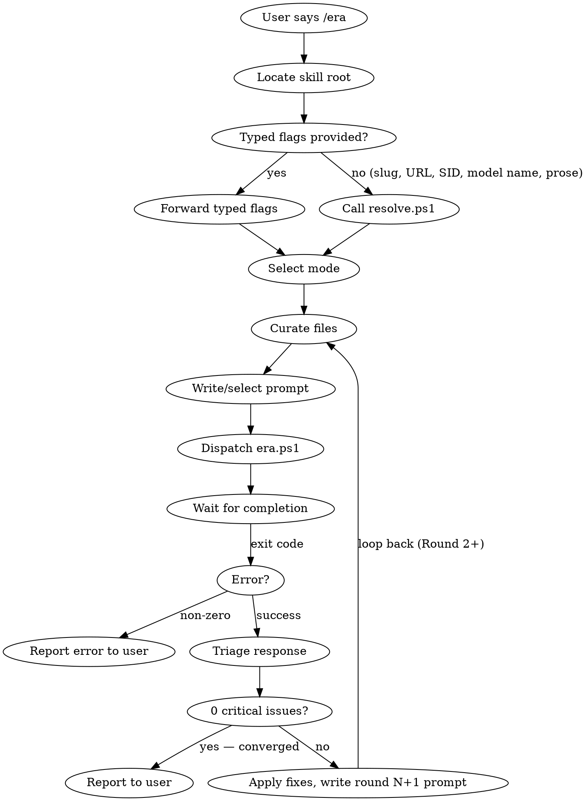

<!-- 2026-05-28: SKILL.md split. Hardening/troubleshooting/internals
     relocated to references/. If you reach for "edge case #7" by section
     name, check references/troubleshooting.md. -->
---
name: external-review-auto
description: Automatically send a curated repomix bundle to an external reviewer (agy/Claude CLI/opencode) for a second opinion. No manual paste step — the backend reads the bundle from disk and the response is captured automatically.
trigger: /external-review-auto
---

# /external-review-auto

## Quick Reference

0. Locate skill root → 1. Resolve input → 2. Select mode → 3. Curate files → 4. Write prompt → 5. Dispatch `era.ps1` → 6. Wait → 7. Triage → 8. Converged (0 criticals)? Done. Otherwise fix, write round N+1 prompt, loop back to step 3.

**Terminal condition:** 0 critical issues. **Always bundle source code.** Details in each section below.

## Prerequisites

| Dependency | Required | Install |
|---|---|---|
| **PowerShell 7+** (`pwsh`) | ✅ Required | `winget install Microsoft.PowerShell` or `brew install powershell` |
| **ThreadJob module** | ✅ Required | `Install-Module -Name ThreadJob -Force -Scope CurrentUser` |
| **repomix** | ✅ Required | `npm install -g repomix` |
| **At least one backend CLI** | ✅ Required | See below |

### Supported backends (pick at least one)

**CLI-based (no API key required — uses your existing subscriptions):**

| Backend | Install command | Reviewer presets |
|---|---|---|
| **agy** (antigravity CLI) | Platform-specific (see agy docs) | `gemini-pro-low` (**default**), `gemini-pro-high`, `gemini` |
| **Claude Code CLI** | `npm install -g @anthropic-ai/claude-code` | `opus`, `sonnet`, `haiku` |
| **opencode** | opencode install | `minimax`, `deepseek` |

**Direct REST (no API key required — pure HTTPS):**

| Backend | API key env var | Reviewer presets |
|---|---|---|
| **geminiapi** | `GEMINI_API_KEY` (free at https://aistudio.google.com/apikey) | `gemini-api`, `gemini-api-pro` |
| **anthropic** | `ANTHROPIC_API_KEY` (https://console.anthropic.com/) | `opus-api`, `sonnet-api`, `haiku-api` |
| **openaicompat** | per-preset (`DEEPSEEK_API_KEY`, `MINIMAX_API_KEY`, …) | `deepseek-api`, `deepseek-reasoner-api`, `minimax-api`; extensible via `_registry.json` to Groq/Together/OpenRouter/any OpenAI-compatible endpoint |

REST adapters bypass the CLI entirely — no subprocess, no TTY exposure, no console pollution, no transcript-file polling. Use them if you want the strongest hermetic guarantees and/or you have direct API keys. Otherwise CLI adapters are fine and free.

The skill fails fast with a clear error if any dependency is missing. CLI presets check for the binary on PATH; REST presets check for the API key env var.

### First run / missing prereqs (guidance for the driving LLM)

- **Preflight:** before the first dispatch on a new machine, run `pwsh runtimes/era.ps1 -Doctor`. It prints one consolidated report — pwsh, ThreadJob, repomix, and every backend CLI/API key — each marked `[ OK ]` / `[MISS]` / `[ -- ]` with the exact fix command, plus a `READY` / `NOT READY` verdict. It only reports; it never installs.
- **On any prereq error** (from `-Doctor` or a failed dispatch), surface the exact missing item and the fix command from the message, then **offer to run it for the user** — e.g. *"repomix isn't installed. Want me to run `npm install -g repomix`?"* — and only run it with their approval. **Never auto-install without asking.** The fix commands are: `Install-Module -Name ThreadJob -Force -Scope CurrentUser`, `npm install -g repomix`, the relevant backend CLI install, or `setx`/`$env:` for an API key (CLI presets reuse the user's existing login — no key needed).
- If **no backend is available**, tell the user they need at least one (cheapest reliable: Claude **Haiku** via the `claude` CLI, or **DeepSeek V4 Flash** via opencode) before a review can run.

> **Default reviewer (adaptive):** a bare `/era` with no `-Reviewer` prefers
> **`gemini-pro-low` (Gemini 3.1 Pro (Low) via agy)** — far more reliable than the old
> Flash default (94% class vs 67%). **But the default adapts to what's installed:** if
> agy isn't available, `/era` auto-selects the first usable backend by preference
> (`gemini-pro-low` → `sonnet` → `deepseek` → `gemini-api`) instead of erroring, and
> prints which it chose. Override the order with `$env:ERA_DEFAULT_REVIEWER` (e.g.
> `ERA_DEFAULT_REVIEWER=haiku`), or pass `-Reviewer` explicitly (an explicit choice is
> respected as-is and still errors if its backend is missing). If NO backend is
> available, `/era` errors with install guidance and points to `-Doctor`.
> **Cost note:** Pro (Low) is **$1.5 in / $5.0 out per M**; the cost-cap prompt still
> fires (unless `-Force`).

## How it works

This skill follows a **single-entry-point** architecture. When the slash command fires, the LLM:

1. **Curates** a file list from conversation context (or lets era.ps1 auto-detect)
2. **Optionally writes** a custom review prompt with background/decisions/context
3. **Delegates** all deterministic work to `era.ps1` — a PowerShell script that handles repomix bundling, cost estimation, backend dispatch, response capture, and metadata

**Do not follow manual workflow steps.** Always delegate to `era.ps1`.

## Default Behavior

**Convergence loop (on by default):** After dispatching, the driving LLM MUST triage the response and continue dispatching rounds until the reviewer returns **0 critical issues**. This is not optional — it is the default terminal condition. The driving LLM may exit early only if: (a) the user explicitly says to stop, or (b) the reviewer is repeating previously-addressed concerns (context staleness). "0 criticals" means the reviewer's response contains no items under "Critical issues" — items under "Important" or "Minor" do not block convergence.

**Always bundle relevant source code:** Every dispatch MUST include source files that give the reviewer enough context to assess the topic. For spec reviews, this means the spec file + files the spec references or modifies. For assessments, this means the files under discussion in the conversation. A prompt-only dispatch (no source bundle) is never correct — the reviewer cannot verify claims about code without seeing the code.

## Invocation Workflow (follow this exactly)

0. **Locate skill root** — check in order: `$env:ERA_SKILL_ROOT`, `$HOME/.claude/skills/external-review-auto/`, `$HOME/.config/opencode/skills/external-review-auto/`. All subsequent paths (`resolve.ps1`, `era.ps1`) are relative to this root. The `/era` shim is a pointer — never call scripts from the shim directory.
1. **Resolve input** — if the user provided typed flags (`-Reviewer X -Model Y`), forward verbatim; otherwise call `<skill-root>/runtimes/resolve.ps1` with whatever the user typed (handles slugs, URLs, SIDs, model names, prose)
2. **Select mode** — see Mode Selection below
3. **Curate files** — see File Curation below
4. **Write or select prompt** — `-SpecReview` for spec reviews; `-PromptOverrideFile` for custom; omit for generic
5. **Dispatch** — `pwsh <skill-root>/runtimes/era.ps1 <flags> -Force`
6. **Wait for completion** — era.ps1 handles polling/capture internally. If era.ps1 exits non-zero, report the error message to the user verbatim — do not retry or attempt recovery.
7. **Triage response** — classify each claim before incorporating (see Handling the response)
8. **Decide: done or round 2?** — if 0 critical issues, report to user (converged). Otherwise go to Round 2+ Workflow.



### Mode Selection

| Condition | Mode | Flag |
|---|---|---|
| You have a design spec file to review | Spec review | `-SpecReview <path>` |
| No spec; reviewing code, a conversation finding, or arbitrary files | Assessment | `-Mode assessment` |
| Auto-detect from recent git state or newest spec | Default | (omit both) |

**These modes are mutually exclusive.** `-SpecReview` implies spec mode; do not combine it with `-Mode assessment`. If neither is passed, era.ps1 auto-detects: scans for the newest spec matching `ERA_SPEC_GLOB` and uses spec-review mode if found; otherwise falls back to assessment mode with auto-detected files.

### File Curation

| Scenario | Approach | Rationale |
|---|---|---|
| Spec review | `-IncludeFiles spec.md,file1.py,file2.py,...` — spec + files it references | Focused context; reviewer sees what the implementation will touch |
| Assessment of recent changes | `-IncludeFiles` from conversation context, or `--auto-detect` | Delta-focused; avoids reviewing unrelated code |
| Broad repo audit | Omit `-IncludeFiles` (era.ps1 globs ~40 extensions) | Full coverage; only for small repos or when scope is unclear |
| Round 2+ | `--diff` + `-IncludeFiles` of changed files only | 4x cheaper; reviewer focuses on fixes, not re-reading unchanged code |

**`--auto-detect` vs omit:** `--auto-detect` derives the file list from `git status` + `HEAD~1` (recent changes only). Omitting `-IncludeFiles` entirely uses broad globs across the whole repo (~40 extensions). Use `--auto-detect` when reviewing recent work; omit only when the scope is genuinely repo-wide.

**Repo-root constraint:** All `-IncludeFiles` paths are resolved relative to the repo root. Files outside the repo (e.g., the SKILL.md itself at `~/.claude/skills/...`) cannot be included. To review external files, copy them into the repo first or reference them in the prompt text.

**Cost guidance:** Every 10K bundle tokens costs ~$0.01-0.03 depending on backend. A 70K-token bundle costs ~$0.15-0.27. Curate aggressively for iterative rounds.

## Parsing natural-language input — call `resolve.ps1` (portable, deterministic)

When the user gives free-form input (e.g. `/era gemini 3.1 pro low`, `/era console-bugs use opus`) rather than typed flags, **do not interpret the rules ad hoc.** Shell out to the deterministic resolver so the resolution is **identical regardless of which model is driving** (Claude, Gemini, an opencode model, etc.):

```pwsh
# positional arg
pwsh "<skill-root>/runtimes/resolve.ps1" "<user input>"
# or via stdin
"<user input>" | pwsh "<skill-root>/runtimes/resolve.ps1"
```

`resolve.ps1` prints **only** a JSON object of typed `era.ps1` flags to stdout, e.g.:

| User input | resolve.ps1 stdout |
|---|---|
| `gemini 3.1 pro low` | `{"Reviewer":"gemini-pro-low"}` |
| `deepseek v4 flash` | `{"Reviewer":"deepseek","Model":"opencode-go/deepseek-v4-flash"}` |
| `console-bugs use opus` | `{"Reviewer":"opus","TopicSlug":"console-bugs"}` |
| (bare / empty) | `{"Reviewer":"gemini-pro-low"}` |
| unmatched/ambiguous | `{"error":"unresolved","input":"<raw>"}` |

Parse the JSON, then forward the keys as `era.ps1` flags (`-Reviewer`, `-Model`, `-TopicSlug`).
If the JSON is `{"error":"unresolved",...}`, **ask the user one clarifying question — never guess.**
If the user already passed typed flags (`--reviewer X --model Y`), forward them verbatim; the
resolver is a friendly fallback, not a replacement. The full human-readable patterns table lives
in `era/SKILL.md`; `resolve.ps1` is the executable, single-source-of-truth version of it.

## Handling the response — triage before incorporating

A review response is a list of *claims*. Some claims are facts (the code does X, this method exists, this error is raised). Some are reasoning (this would cause Y under Z conditions, A is preferred over B). **Auto-incorporating every claim without verification is the failure mode this skill is designed to AVOID.** A reviewer can be wrong, out of date, or hallucinating an API that doesn't exist.

**Before incorporating any finding, classify it:**

| Claim type | Examples | Action before incorporating |
|---|---|---|
| **Empirical — specific code/API behavior** | "pandas raises ValueError on duplicate-index reindex", "sqlite3 connections aren't thread-safe", "this SDK method returns shape X", "HTTP status 404 indicates Y" | **Validate via probe.** Run the code path, read the live SDK output, check the actual exception. Cite the validation in the spec amendment. |
| **Code-reading — claims about the spec or repo** | "view.py:114 hardcodes `_accounts[0]`", "the dataclass has no `headline` field", "the spec says X but Y" | **Read the cited file.** Confirm the claim against actual source. |
| **Known platform behavior** | Python defaults, well-documented library quirks, OS conventions | **Trust + cite the doc** (or quickly check if in doubt). |
| **Design reasoning / consistency** | "this would scale-mismatch", "this design contradicts an earlier decision", "this is the standard GIPS approach" | **Reason about it yourself.** If the logic holds, incorporate; if not, push back. |

When auto-incorporating across multiple review rounds, this triage decays unless deliberately maintained. Watch for the "auto-pilot" failure mode where after 2-3 rounds the conductor stops thinking and just folds whatever the reviewer says. **Validate at least one empirical claim per round to keep the muscle warm.**

Skip incorporation entirely when:
- The claim contradicts something already validated (the reviewer may not have the full context)
- The "fix" introduces complexity beyond the original scope without clear necessity
- The "important issue" is a stylistic preference, not a defect

Be willing to push back in your next round's prompt: "Round N-1 raised X, but after probing I found Y — please re-evaluate."

## Round 2+ Workflow

When round N's response contains critical issues:

1. **Triage round N response** — classify each finding using the claim-type table above
2. **Apply fixes** — address critical and important issues in the codebase/spec
3. **Write round N+1 prompt** — include:
   - A verbatim summary of round N's verdict, or include the literal string `{{PREVIOUS_ROUND}}` in your prompt file — era.ps1 auto-substitutes it with the full text of round-(N-1)'s response at bundle time
   - What changed since round N ("Fixed critical #1 by...", "Rejected important #3 because...")
   - Specific questions for the reviewer ("Is the fix for X correct?", "Did I introduce new issues?")
4. **Curate round N+1 files** — pass `--diff` (only bundles files with uncommitted changes, skipping unchanged files) and `-IncludeFiles` with only changed files (4x cheaper than re-bundling everything)
5. **Dispatch** — `pwsh <skill-root>/runtimes/era.ps1 -TopicSlug <slug> -PromptOverrideFile <path> --diff -IncludeFiles <changed-files> -Force`
6. **Return to primary workflow step 6** — wait for completion, triage, check convergence. This closes the loop.

### When to stop iterating

- **Default terminal condition:** 0 critical issues in the reviewer's response. This is when convergence is reached.
- **Early exit (user-initiated only):** the user explicitly says to stop
- **Early exit (staleness):** the reviewer is repeating concerns you've already addressed across 2+ consecutive rounds
- **Push back** when a finding contradicts something already validated — include the counter-evidence in the next prompt
- **Typical convergence:** 2-4 rounds for focused specs, 5-8 for complex architectural reviews

## Pitfalls (driving LLM)

| Don't | Why | Do instead |
|---|---|---|
| Don't run repomix manually then paste | era.ps1 handles bundling, round numbering, metadata, and capture | Always dispatch via era.ps1 |
| Don't guess the reviewer preset name | Typos fail silently or route to wrong backend | Use resolve.ps1 for natural language, or check the preset table in the Supported backends section |
| Don't skip triage on round 3+ | Auto-pilot mode kicks in; you stop verifying claims | Validate at least one empirical claim per round |
| Don't tell agy-backend reviewers to "read the files" | Triggers tool-use mode; response is a ~120-char planner preamble | Say "review ONLY what is in the attached bundle" (already in the -SpecReview template) |
| Don't re-bundle everything on round 2+ | 4x more expensive; reviewer re-reads unchanged code | Use `--diff` + curated `-IncludeFiles` |
| Don't pass absolute paths or paths outside the repo to `-IncludeFiles` | era.ps1 resolves relative to repo root; external paths fail with "not found" | Copy external files into the repo, or reference them in prompt text only |
| Don't call `resolve.ps1` or `era.ps1` from the `/era` shim directory | The shim is a pointer; the runtime lives at the canonical skill root | Locate skill root first (Step 0 of the workflow) |

## Usage

```
/external-review-auto                           # auto-detect topic, full review
/external-review-auto <topic-slug>              # explicit topic
/external-review-auto --mode assessment         # review code (no spec required)
/external-review-auto --reviewer opus           # use Claude Sonnet backend
/external-review-auto --model "gemini 3.1 pro"  # specific model
```

### All flags

| Flag | era.ps1 flag | Purpose |
|------|-------------|---------|
| `<topic-slug>` (positional) | `-TopicSlug <slug>` | Explicit topic (auto-detected from newest spec if omitted) |
| `--doctor` | `-Doctor` | Preflight only: report prereq + backend status (with fix commands) and exit. No dispatch, no install. |
| `--mode assessment` | `-Mode assessment` | No spec file required; reviews arbitrary code |
| `--reviewer <name>` | `-Reviewer <name>` | Comma-separated for multi-reviewer: `gemini,opus`. Default (omitted) = `gemini-pro-low` (Gemini 3.1 Pro (Low)) |
| `--model <hint>` | `-Model <hint>` | Override model: `"gemini 3.1 pro"`, `"deepseek v4 pro"` |
| `--provider <name>` | `-Provider <name>` | Force a specific opencode provider |
| `--include <path1,path2>` | `-IncludeFiles path1,path2` | Specific files to bundle (curated by LLM) |
| `--prompt-override <path>` | `-PromptOverrideFile path` | LLM pre-wrote a custom prompt at this path |
| `--force` | `-Force` | Skip cost confirmation prompt |
| `--diff` | `-Diff` | Round 2+: only bundle changed files (opt-in) |
| `--auto-detect` | `-AutoDetect` | Derive include list from `git status` + `HEAD~1` (human use) |
| `--spec-review <path>` | `-SpecReview <path>` | One-flag spec review: auto-fills template + bundles spec |

### LLM-driven file selection

Pass specific files via `-IncludeFiles` to avoid bundling the whole repo. Curate the list from conversation context:

```pwsh
pwsh ~/.claude/skills/external-review-auto/runtimes/era.ps1 -IncludeFiles src/file1.py,src/file2.py,docs/spec.md
```

> **Windows + Bash tool quoting:** When invoking `era.ps1` via the Bash tool on Windows, `-IncludeFiles "a","b","c"` (individually-quoted elements) gets parsed by the Windows command line as a single argument `"a,b,c"`. **Use UNQUOTED comma-separated paths** as shown above — PowerShell's `[string[]]` parameter binder natively splits on commas. era.ps1 will also auto-split any element containing a comma into separate paths, so a single-quoted comma-string `"a,b,c"` also works, but the unquoted form is clearest.

Without `-IncludeFiles`, era.ps1 uses **broad default globs** covering ~40 common extensions (`.md`, `.py`, `.ps1`, `.json`, `.ts`, `.tsx`, `.js`, `.go`, `.rs`, `.java`, `.c`, `.cpp`, `.rb`, `.sh`, `.sql`, `.tf`, `.graphql`, `Dockerfile`, `Makefile`, etc.) — works out of the box on most repos. Narrow or override with `$env:ERA_DEFAULT_GLOBS` (comma-separated list, e.g. `'**/*.rs,**/*.toml,**/*.md'`).

### LLM-driven prompt

Write a rich prompt (with background, decisions, conversation context) to a temp path, then pass it:

```pwsh
# Step 1: write prompt
Set-Content -Path .external-reviews/my-topic/pending-prompt.md -Value "..."

# Step 2: invoke era.ps1 with the prompt and curated files
pwsh ~/.claude/skills/external-review-auto/runtimes/era.ps1 -TopicSlug my-topic -PromptOverrideFile .external-reviews/my-topic/pending-prompt.md -IncludeFiles src/file1.py,src/file2.py
```

era.ps1 copies your prompt to the correct `round-N-prompt.md` after resolving N internally. Without `-PromptOverrideFile`, era.ps1 writes a generic fallback.

For round N > 1, include `{{PREVIOUS_ROUND}}` anywhere in your prompt to auto-substitute round-(N-1)'s response.

### Quick examples

```pwsh
# Preflight: check prerequisites + backend availability (no dispatch)
pwsh ~/.claude/skills/external-review-auto/runtimes/era.ps1 -Command doctor

# Auto-detect context and dispatch (newest spec or recent git changes)
pwsh ~/.claude/skills/external-review-auto/runtimes/era.ps1 -Command review-this

# Scan for review targets (specs, commits, existing topics — no dispatch)
pwsh ~/.claude/skills/external-review-auto/runtimes/era.ps1 -Command suggest

# Update model registry from connected opencode providers
pwsh ~/.claude/skills/external-review-auto/runtimes/era.ps1 -Command update-models

# Default: auto-detect topic, gemini-pro-low = Gemini 3.1 Pro (Low) via agy backend
pwsh ~/.claude/skills/external-review-auto/runtimes/era.ps1

# Explicit topic, Claude Sonnet
pwsh ~/.claude/skills/external-review-auto/runtimes/era.ps1 -TopicSlug purchase-cooldown -Reviewer opus

# Multi-reviewer (agy + Claude + opencode)
pwsh ~/.claude/skills/external-review-auto/runtimes/era.ps1 -Reviewer gemini,opus,minimax

# One-flag spec review (auto-detects spec via ERA_SPEC_GLOB if no path given)
pwsh ~/.claude/skills/external-review-auto/runtimes/era.ps1 -SpecReview docs/my-project/specs/2026-05-28-design.md -Reviewer gemini -Model 'gemini 3.1 pro'
```

### CI/CD / non-interactive mode

Set `$env:ERA_FORCE=1` to skip the cost confirmation prompt.

### Environment variables

| Variable | Default | Purpose |
|---|---|---|
| `ERA_FORCE` | (unset) | Set to `1` to skip the cost confirmation prompt (non-interactive mode) |
| `ERA_DEFAULT_REVIEWER` | `gemini-pro-low` | Reviewer preset for bare `/era` (no `-Reviewer`). Overrides the adaptive fallback order. |
| `ERA_DEFAULT_GLOBS` | (broad ~40-extension set) | Comma-separated repomix globs for auto-detected bundles when `-IncludeFiles` is not passed. Example: `'**/*.rs,**/*.toml,**/*.md'` |
| `ERA_SPEC_GLOB` | `docs/superpowers/specs/*-design.md` | Glob for auto-detecting design spec files (topic slug, auto-detection, suggest command). Change for non-superpowers repos. Example: `'docs/**/*-design.md'` |

## Prompt templates

Use these when writing custom prompts via `-PromptOverrideFile`.

> **Stub variables vs auto-substituted variables:** `{{BACKGROUND_FROM_SPEC}}`, `{{DECISIONS_FROM_SPEC}}`, `{{FILE_LIST}}`, etc. are **manual placeholders** — you fill them in yourself when writing the prompt. Only `{{PREVIOUS_ROUND}}` is auto-substituted by era.ps1 at bundle time.

> ### ⚠️ Agentic-backend rule: never tell the model to "read/open/view files"
>
> The `agy` backend (Gemini via Antigravity) is an **agentic planner**, not a single-shot completion model. Its response is captured from agy's transcript (`PLANNER_RESPONSE` entries). If your override prompt instructs the model to *"read the bundled source files,"* *"cite the file/function you read,"* or otherwise invites file access, agy will try to **use its own tools to open files** — emitting a planner preamble like `"I will view <file> from line X to Y…"` (often a file **not even in the bundle**). The capture grabs only that ~120-char preamble and you get a truncated non-review. Wall-clock looks normal (~300s); `response_chars` is ~110–130.
>
> **The bundle is already self-contained — say so.** Open every override with: *"The spec and all source files are fully included in the attached bundle. Review ONLY what is in the bundle. Do NOT attempt to open, view, fetch, or read any file outside the bundle."* You may still ask the reviewer to **reference** `file:line` *in its findings* (the spec-review template does) — that's about citing, not opening. The distinction is "cite what's attached" (safe) vs. "go read the source" (triggers tool-use).
>
> This only bites the `-PromptOverrideFile` path; the default `-SpecReview` template is already worded safely. Non-agentic backends (Claude CLI `opus`/`sonnet`, `geminiapi`, `opencode`/`deepseek`/`minimax`) are immune — they return a single completion regardless — so a truncating agy run can be re-dispatched to one of those as a fallback. See `references/troubleshooting.md`.

### Spec review template

```markdown
# External Review Prompt — {{TOPIC_TITLE}}

You are reviewing a design spec for {{ONE_SENTENCE_PROJECT_DESCRIPTION}}.

The spec is `{{SPEC_PATH}}` (included in the attached bundle). Every other file in the bundle is **existing code** the implementation will touch or that provides necessary context for the design decisions.

## Background

{{BACKGROUND_FROM_SPEC}}

## Decisions already made (don't re-litigate; review for *correctness within these constraints*)

{{DECISIONS_FROM_SPEC}}

## What to review

Please assess the spec for the following, in priority order. **Be specific** — point to file paths, line numbers, exact functions.

### 1. Correctness — does the design actually solve the problem?
### 2. Race conditions / concurrency
### 3. Compatibility with existing code paths and conventions
### 4. Persistence / migration plumbing (only if applicable; skip if not)
### 5. Edge cases the spec missed
### 6. Testability — are the proposed tests sufficient?
### 7. Anything else wrong, missing, or under-specified.

## Output format

` `` `
## Critical issues (must fix before implementation)
1. <file:line> — <issue> — <suggested fix>

## Important issues (should fix)
1. ...

## Minor / nits
1. ...

## Things the spec got right (briefly, so I know what's solid)
1. ...

## Open questions for the author
1. ...
` `` `

Be terse. Don't pad. If a section is empty, write "(none)".
```

### Assessment (code review) template

```markdown
# External Review — {{TOPIC_TITLE}}

You are reviewing {{SUBJECT_DESCRIPTION}}.

The following files are attached for your review:
{{FILE_LIST}}

## Context from conversation

{{CONVERSATION_CONTEXT}}

## What to review

Please assess:
1. **Correctness** — are the claims / implementation accurate?
2. **Completeness** — what's missing?
3. **Edge cases** — what could break?
4. **Actionability** — are the suggestions well-targeted?

## Output format

` `` `
## Critical issues
1. ... — ...

## What is correct
1. ...

## What's missing or under-weighted
1. ...

## Suggestions
1. ...

## Final verdict
<one sentence>
` `` `

Be terse. Don't pad. If a section is empty, write "(none)".
```

## Constraints

- **`ignore.useGitignore: false` + `ignore.useDefaultPatterns: false`** in every repomix config (prevents the project's existing repomix config from ballooning the bundle).
- **Round numbers stay monotonic** across both auto and manual reviews (shared counter per topic slug).
- **Never pass bundle content through argv** — always use a file path on disk.
- **Prompt file must be written BEFORE repomix** — `instructionFilePath` is read at bundle time.

## If invocation fails

- For edge cases and known errors: see `references/troubleshooting.md`
- For hardening details, opencode variant resolution, parallel-dispatch mechanics, and maintainer notes: see `references/internals.md`

## See also

- `references/internals.md` — hardening details, opencode variant resolution, parallel-dispatch mechanics, maintainer notes
- `references/troubleshooting.md` — edge cases and known errors with fixes

## Conversation context hand-off (`-ConversationFile`) — 2026-06-10

`era.ps1` cannot see the calling conversation. The typed channel for it is
`-ConversationFile <path>` (absolute paths anywhere are fine — the file is
read into the prompt, never bundled). Before dispatch, the calling agent
writes a distillation file containing:

```markdown
# Session context — <topic>
## Goal
<what this session is trying to accomplish>
## Current state
<what has been done/decided so far; key file:line anchors>
## Findings / claims to scrutinize
<numbered; each with the evidence the agent has>
## Decisions already made (do not re-litigate)
<list>
## Open questions for the reviewer
<list>
```

Injection rules: a `{{CONVERSATION_CONTEXT}}` placeholder in the prompt is
replaced; generated/template prompts get a `## Session context` section
inserted before `## Output format`; a user-supplied `-PromptOverrideFile`
honors the file ONLY via the placeholder (else **hard error** — silently
dropping context is the failure mode this flag exists to fix). A dispatch
with neither spec nor ConversationFile context is degraded mode and warns.
A prompt-only dispatch (no source bundle) remains forbidden.

## Out-of-repo source files in the bundle (P6) — 2026-06-10

`-IncludeFiles` accepts **absolute paths outside the repo** (e.g. skill
sources under `~/.claude/`): era.ps1 stages a copy into the round's artifact
dir with the source path mirrored —
`.external-reviews/<slug>/round-N-external/HOME/.claude/.../file.ps1` — so
bundle citations still identify the real file. **Privacy:** home-rooted
sources mirror under `HOME/` so the bundle (which is sent to an external
reviewer API) never embeds `Users/<name>`; non-home paths keep a
drive-stripped mirror. Staged copies persist as round artifacts. Files only
(out-of-repo dirs/globs throw). Relative traversal (`../secret`) remains
blocked — typing the full absolute path is the explicit opt-in.

## Conductor protocol (NORMATIVE — any calling model, any platform) — 2026-06-10

The transport (era.ps1) is deterministic; review QUALITY depends on the
calling model executing this protocol. It is part of the skill, not optional.

1. **Triage every claim by type** before incorporating: *empirical* (run the
   code/measurement), *code-reading* (open the cited site), *known-issue*
   (cross-check the record), *reasoning* (argue it). Validate at least one
   empirical claim per round; spot-check every code-reading claim AT the
   cited location. Treat reviewer line numbers as untrusted until they match
   the file (see history: fabricated `file:line` observed on correct AND
   incorrect claims in the same round).
2. **Record disposition per claim** in the spec under review:
   CONFIRMED (with what verified it) / REJECTED (with the evidence) /
   DEFERRED (with why). The "External review (round N)" sections in the
   originating design specs are the reference format.
3. **Iteration policy.** Continue rounds without approval pauses while a
   round yields ≥1 confirmed critical/important finding not already
   absorbed. STOP when: a round yields none (converged); OR 4 rounds elapse
   (escalate the open disagreement to the human); OR the subject is a
   findings/measurement document (one round — reviewers cannot refute
   measurements); OR **a round's critical findings are confabulations**
   (observed 2026-06-10: when a fabricated citation was rejected, the
   reviewer invented corroborating detail — a 1,693-line file, fake line
   content — instead of conceding; further rounds re-litigate fiction.
   Harvest incidental lower-tier findings, then stop).
4. **Rejection hygiene.** When a claim is rejected, the next round's prompt
   must state the rejection as established fact WITH evidence ("era.ps1 is
   1,040 lines; line 860 reads `$configData = @{`") — or drop the disputed
   thread entirely. Leaving the reviewer's original claim visible without
   the counter-evidence invites doubling-down.
