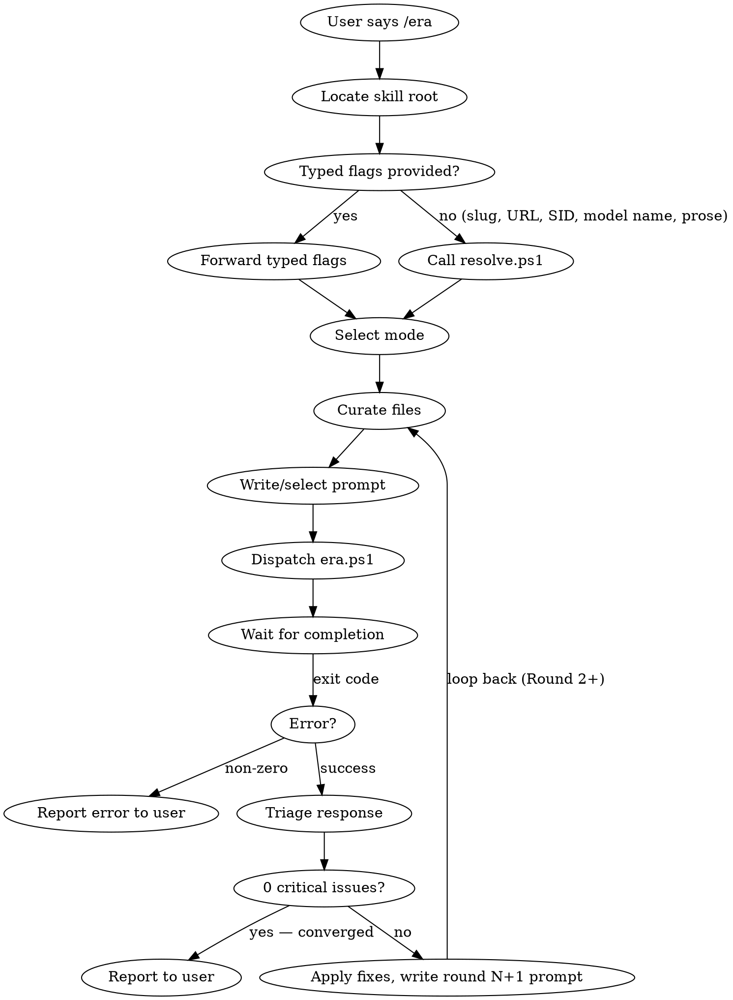

<!-- 2026-05-28: SKILL.md split. Hardening/troubleshooting/internals
     relocated to references/. If you reach for "edge case #7" by section
     name, check references/troubleshooting.md. -->
---
name: external-review-auto
description: Automatically send a curated repomix bundle to an external reviewer (agy/Claude CLI/opencode) for a second opinion. No manual paste step — the backend reads the bundle from disk and the response is captured automatically.
trigger: /external-review-auto
---

# /external-review-auto

## Quick Reference

0. Locate skill root → 1. Resolve input → 2. Select mode → 3. Curate files → 4. Write prompt → 5. Dispatch `era.ps1` → 6. Wait → 7. Triage → 8. Converged (0 criticals)? Done. Otherwise fix, write round N+1 prompt, loop back to step 3.

**Terminal condition:** 0 critical issues. **Always bundle source code.** Details in each section below.

## Prerequisites

| Dependency | Required | Install |
|---|---|---|
| **PowerShell 7+** (`pwsh`) | ✅ Required | `winget install Microsoft.PowerShell` or `brew install powershell` |
| **ThreadJob module** | ✅ Required | `Install-Module -Name ThreadJob -Force -Scope CurrentUser` |
| **repomix** | ✅ Required | `npm install -g repomix` |
| **At least one backend CLI** | ✅ Required | See below |

### Supported backends (pick at least one)

**CLI-based (no API key required — uses your existing subscriptions):**

| Backend | Install command | Reviewer presets |
|---|---|---|
| **agy** (antigravity CLI) | Platform-specific (see agy docs) | `gemini` (Gemini 3.6 Flash, **in the default panel**), `gemini-pro-high`, `gemini-pro-low`, `gemini-flash-35` |
| **Claude Code CLI** | `npm install -g @anthropic-ai/claude-code` | `opus`, `sonnet`, `haiku` |
| **opencode** | opencode install | `minimax`, `deepseek` |

**Direct REST (no API key required — pure HTTPS):**

| Backend | API key env var | Reviewer presets |
|---|---|---|
| **geminiapi** | `GEMINI_API_KEY` (free at https://aistudio.google.com/apikey) | `gemini-api`, `gemini-api-pro` |
| **anthropic** | `ANTHROPIC_API_KEY` (https://console.anthropic.com/) | `opus-api`, `sonnet-api`, `haiku-api` |
| **openaicompat** | per-preset (`DEEPSEEK_API_KEY`, `MINIMAX_API_KEY`, …) | `deepseek-api`, `deepseek-reasoner-api`, `minimax-api`; extensible via `_registry.json` to Groq/Together/OpenRouter/any OpenAI-compatible endpoint |
| **opencode (HTTP, v1.8)** | `OPENCODE_API_KEY` / `NVIDIA_API_KEY` — **auto-sourced from opencode `auth.json` if unset** | `deepseek-http`, `glm-http`, `minimax-http`, `kimi-http`, `nvidia` — opencode-go models + free NVIDIA NIM over **direct HTTP (no TUI)**. Set `ERA_USE_HTTP_OPENCODE=1` to route the `deepseek`/`minimax` aliases here automatically. |

REST adapters bypass the CLI entirely — no subprocess, no TTY exposure, no console pollution, no transcript-file polling. Use them if you want the strongest hermetic guarantees and/or you have direct API keys. Otherwise CLI adapters are fine and free.

The skill fails fast with a clear error if any dependency is missing. CLI presets check for the binary on PATH; REST presets check for the API key env var.

### First run / missing prereqs (guidance for the driving LLM)

- **Preflight:** before the first dispatch on a new machine, run `pwsh runtimes/era.ps1 -Doctor`. It prints one consolidated report — pwsh, ThreadJob, repomix, and every backend CLI/API key — each marked `[ OK ]` / `[MISS]` / `[ -- ]` with the exact fix command, plus a `READY` / `NOT READY` verdict. It only reports; it never installs.
- **On any prereq error** (from `-Doctor` or a failed dispatch), surface the exact missing item and the fix command from the message, then **offer to run it for the user** — e.g. *"repomix isn't installed. Want me to run `npm install -g repomix`?"* — and only run it with their approval. **Never auto-install without asking.** The fix commands are: `Install-Module -Name ThreadJob -Force -Scope CurrentUser`, `npm install -g repomix`, the relevant backend CLI install, or `setx`/`$env:` for an API key (CLI presets reuse the user's existing login — no key needed).
- If **no backend is available**, tell the user they need at least one (cheapest reliable: Claude **Haiku** via the `claude` CLI, or **DeepSeek V4 Flash** via opencode) before a review can run.

### Where the default lives

`<skill-root>/config/defaults.json` — the single source of truth, read by BOTH
layers (`resolve.ps1` and `era.ps1`) through the shared `runtimes/_era-defaults.ps1`.
It is located from `$PSScriptRoot`, so Claude Code, PowerShell, WSL, opencode and
agy all resolve the same default regardless of shell, environment or working
directory.

```json
{ "reviewer": ["gemini", "opus", "deepseek-flash", "muse-spark"] }
```

Precedence, highest first: explicit `-Reviewer` -> `$env:ERA_DEFAULT_REVIEWER`
(deliberate per-session override) -> `config/defaults.json` -> a shipped
fallback panel that is never empty.

Change it with `/era set default <names>` (accepts a panel), or edit the file.

> **Default reviewers (a 4-model panel, run simultaneously):** a bare `/era` with no
> `-Reviewer` dispatches **`gemini,opus,deepseek-flash,muse-spark`** — Gemini 3.6
> Flash (agy), Claude Opus 5 (claude CLI), DeepSeek V4 Flash (New) (opencode-go) and
> Muse Spark 1.2 Contributor (opencode-go). Cross-vendor on purpose: in round 11 one
> reviewer reviewed the wrong subject entirely while another found a real shipped
> regression, so a single reviewer is a single point of failure whichever one you
> pick. Cost is dominated by Opus (~$5/$25 per M vs ~$0.3, ~$0.14 and ~$0.10) — pass
> `-Reviewer gemini` for a cheap single run.
>
> The 4th seat was `ox-alpha` from 2026-08-22 until 2026-08-26, when opencode stopped
> offering that model entirely — so a bare `/era` would have been dispatching a
> reviewer that cannot run. A registry `retired` flag and a test now keep a withdrawn
> model out of the default panel.
> **The single-reviewer fallback still adapts to what's installed:** if
> agy isn't available, `/era` auto-selects the first usable backend by preference
> (`gemini-pro-low` → `sonnet` → `deepseek` → `gemini-api`) instead of erroring, and
> prints which it chose. Override the order with `$env:ERA_DEFAULT_REVIEWER` (e.g.
> `ERA_DEFAULT_REVIEWER=haiku`), or pass `-Reviewer` explicitly (an explicit choice is
> respected as-is and still errors if its backend is missing). If NO backend is
> available, `/era` errors with install guidance and points to `-Doctor`.
> **Cost note:** Pro (Low) is **$1.5 in / $5.0 out per M**; the cost-cap prompt still
> fires (unless `-Force`).

## How it works

This skill follows a **single-entry-point** architecture. When the slash command fires, the LLM:

1. **Curates** a file list from conversation context (or lets era.ps1 auto-detect)
2. **Optionally writes** a custom review prompt with background/decisions/context
3. **Delegates** all deterministic work to `era.ps1` — a PowerShell script that handles repomix bundling, cost estimation, backend dispatch, response capture, and metadata

**Do not follow manual workflow steps.** Always delegate to `era.ps1`.

## Default Behavior

**Convergence loop (on by default):** After dispatching, the driving LLM MUST triage the response and continue dispatching rounds until the reviewer returns **0 critical issues**. This is not optional — it is the default terminal condition. The driving LLM may exit early only if: (a) the user explicitly says to stop, or (b) the reviewer is repeating previously-addressed concerns (context staleness). "0 criticals" means the reviewer's response contains no items under "Critical issues" — items under "Important" or "Minor" do not block convergence.

**Always bundle relevant source code:** Every dispatch MUST include source files that give the reviewer enough context to assess the topic. For spec reviews, this means the spec file + files the spec references or modifies. For assessments, this means the files under discussion in the conversation. A prompt-only dispatch (no source bundle) is never correct — the reviewer cannot verify claims about code without seeing the code.

## Invocation Workflow (follow this exactly)

0. **Locate skill root** — check in order: `$env:ERA_SKILL_ROOT`, `$HOME/.claude/skills/external-review-auto/`, `$HOME/.config/opencode/skills/external-review-auto/`. All subsequent paths (`resolve.ps1`, `era.ps1`) are relative to this root. The `/era` shim is a pointer — never call scripts from the shim directory.
   - **WSL host dispatching Windows `pwsh.exe`:** when the skill root resolves to a WSL path (`/home/…` or a symlink into `/mnt/<drive>/…`), pass it to `pwsh.exe` as a **native Windows path** (`wslpath -w "$root"` → e.g. `C:\Users\…\external-review-auto\runtimes\era.ps1`). Do **not** use a `\\wsl.localhost\…` UNC path — if the skill dir is a symlink to the Windows drive it round-trips (Windows → 9P → symlink → DrvFs → back to the drive), which is slow and fragile. The Windows-native path is direct.
1. **Resolve input** — if the user provided typed flags (`-Reviewer X -Model Y`), forward verbatim; otherwise call `<skill-root>/runtimes/resolve.ps1` with whatever the user typed (handles slugs, URLs, SIDs, model names, prose)
2. **Select mode** — see Mode Selection below
3. **Curate files** — see File Curation below
4. **Write or select prompt** — `-SpecReview` for spec reviews; `-PromptOverrideFile` for custom; omit for generic
5. **Dispatch** — `pwsh <skill-root>/runtimes/era.ps1 <flags> -Force`
6. **Wait for completion** — era.ps1 handles polling/capture internally. If era.ps1 exits non-zero, report the error message to the user verbatim — do not retry or attempt recovery.
   - **Exit 0** — a reviewer produced a readable review. Proceed to triage.
   - **Exit 1** — preflight refusal (bad `-IncludeFiles`, empty bundle, dirty tree). Nothing was dispatched and nothing was spent, so fixing the named problem and re-running is free.
   - **Exit 2** — the round ran and produced **no usable review**: every reviewer either wrote no response file or had its answer rejected. Real money was already spent and the artifacts are kept for diagnosis, so **never silently re-dispatch**. Report the per-reviewer breakdown era printed, and ask the user before spending again. Exit 2 never means "no findings" — it means nothing was reviewed.
7. **Triage response** — classify each claim before incorporating (see Handling the response)
8. **Decide: done or round 2?** — if 0 critical issues, report to user (converged). Otherwise go to Round 2+ Workflow.


```dot
digraph era_flow {
    "User says /era" -> "Locate skill root";
    "Locate skill root" -> "Typed flags provided?";
    "Typed flags provided?" -> "Forward typed flags" [label="yes"];
    "Typed flags provided?" -> "Call resolve.ps1" [label="no (slug, URL, SID, model name, prose)"];
    "Call resolve.ps1" -> "Select mode";
    "Forward typed flags" -> "Select mode";
    "Select mode" -> "Curate files";
    "Curate files" -> "Write/select prompt";
    "Write/select prompt" -> "Dispatch era.ps1";
    "Dispatch era.ps1" -> "Wait for completion";
    "Wait for completion" -> "Error?" [label="exit code"];
    "Error?" -> "Report error to user" [label="non-zero"];
    "Error?" -> "Triage response" [label="success"];
    "Triage response" -> "0 critical issues?";
    "0 critical issues?" -> "Report to user" [label="yes — converged"];
    "0 critical issues?" -> "Apply fixes, write round N+1 prompt" [label="no"];
    "Apply fixes, write round N+1 prompt" -> "Curate files" [label="loop back (Round 2+)"];
}
```

### Mode Selection

| Condition | Mode | Flag |
|---|---|---|
| You have a design spec file to review | Spec review | `-SpecReview <path>` |
| No spec; reviewing code, a conversation finding, or arbitrary files | Assessment | `-Mode assessment` |
| Auto-detect from recent git state or newest spec | Default | (omit both) |

**These modes are mutually exclusive.** `-SpecReview` implies spec mode; do not combine it with `-Mode assessment`. If neither is passed, era.ps1 auto-detects: scans for the newest spec matching `ERA_SPEC_GLOB` and uses spec-review mode if found; otherwise falls back to assessment mode with auto-detected files.

### File Curation

| Scenario | Approach | Rationale |
|---|---|---|
| Spec review | `-IncludeFiles spec.md,file1.py,file2.py,...` — spec + files it references | Focused context; reviewer sees what the implementation will touch |
| Assessment of recent changes | `-IncludeFiles` from conversation context, or `--auto-detect` | Delta-focused; avoids reviewing unrelated code |
| Broad repo audit | Omit `-IncludeFiles` (era.ps1 globs ~40 extensions) | Full coverage; only for small repos or when scope is unclear — **gated, see below** |
| Round 2+ | `--diff` + `-IncludeFiles` of changed files only | 4x cheaper; reviewer focuses on fixes, not re-reading unchanged code |

**`--auto-detect` vs omit:** `--auto-detect` derives the file list from `git status` + `HEAD~1` (recent changes only). Omitting `-IncludeFiles` entirely uses broad globs across the whole repo (~40 extensions). Use `--auto-detect` when reviewing recent work; omit only when the scope is genuinely repo-wide.

**The broad path announces itself and is gated (2026-08-09).** Before repomix
runs, era enumerates what the default globs actually resolve to and prints it:

```
[era] BROAD BUNDLE — no -IncludeFiles was given, so the repo-wide default globs apply.
[era]   repo root : C:\Users\you\Projects
[era]   files     : >5000
[era]   size      : > 1277.4 MB (approx, pre-bundle)
[era]   gitignore : NOT honoured (useGitignore=false) — ignored files are bundled too
[era]   sending to: gemini, opus
```

Above the ceiling (default **1000 files / 10 MB**, moved with
`ERA_BROAD_MAX_FILES` / `ERA_BROAD_MAX_BYTES`) era refuses.

**`-Force` does NOT bypass this.** `-Force` means "skip the *cost* prompt", and
the normative dispatch line in step 5 above passes it on every call — folding
scale consent into it would leave this gate inert for the only caller the skill
documents. Scale consent has its own signal: **`-ForceBroadScope`**, or
`ERA_BROAD_FORCE=1`. The enumeration short-circuits at 5001 entries, so measuring a runaway
repo costs ~2s rather than the 18-minute repomix crash it replaces. It is
deliberately **not** `git ls-files`: `useGitignore=false` makes the include set a
superset of tracked files, so git would under-report exactly the repo that hurts.

**Repo-root constraint:** All `-IncludeFiles` paths are resolved relative to the repo root. Files outside the repo (e.g., the SKILL.md itself at `~/.claude/skills/...`) cannot be included. To review external files, copy them into the repo first or reference them in the prompt text.

**Cost guidance:** Every 10K bundle tokens costs ~$0.01-0.03 depending on backend. A 70K-token bundle costs ~$0.15-0.27. Curate aggressively for iterative rounds.

## Parsing natural-language input — call `resolve.ps1` (portable, deterministic)

When the user gives free-form input (e.g. `/era gemini 3.1 pro low`, `/era console-bugs use opus`) rather than typed flags, **do not interpret the rules ad hoc.** Shell out to the deterministic resolver so the resolution is **identical regardless of which model is driving** (Claude, Gemini, an opencode model, etc.):

```pwsh
# positional arg
pwsh "<skill-root>/runtimes/resolve.ps1" "<user input>"
# or via stdin
"<user input>" | pwsh "<skill-root>/runtimes/resolve.ps1"
```

`resolve.ps1` prints **only** a JSON object of typed `era.ps1` flags to stdout, e.g.:

| User input | resolve.ps1 stdout |
|---|---|
| `gemini 3.1 pro low` | `{"Reviewer":"gemini-pro-low"}` |
| `deepseek v4 flash` | `{"Reviewer":"deepseek","Model":"opencode-go/deepseek-v4-flash"}` |
| `deepseek` (bare, no variant) | `{"Reviewer":"deepseek-flash"}` — **DeepSeek V4 Flash (New)** is the family default (2026-08-03) |
| `deepseek pro` / `deepseek v4 pro` | `{"Reviewer":"deepseek"}` — the `deepseek` preset is `opencode-go/deepseek-v4-pro` |
| `console-bugs use opus` | `{"Reviewer":"opus","TopicSlug":"console-bugs"}` |
| (bare / empty) | `{"Reviewer":"gemini,opus,deepseek-flash,muse-spark"}` (the default panel) |
| unmatched/ambiguous | `{"error":"unresolved","input":"<raw>"}` |

Parse the JSON, then forward the keys as `era.ps1` flags (`-Reviewer`, `-Model`, `-TopicSlug`).
If the JSON is `{"error":"unresolved",...}`, **ask the user one clarifying question — never guess.**
If the user already passed typed flags (`--reviewer X --model Y`), forward them verbatim; the
resolver is a friendly fallback, not a replacement. The full human-readable patterns table lives
in `era/SKILL.md`; `resolve.ps1` is the executable, single-source-of-truth version of it.

### Command routing (NOT reviewer selection)

Some `/era` inputs are management commands, not review dispatches. Route these to a
`-Command` instead of bundling/dispatching:

- **`/era models`** (also "list reviewers", "what models can I use", "show backends") →
  run `pwsh <skill-root>/runtimes/era.ps1 -Command list`. Read-only: it prints every
  preset grouped by backend with ✓/✗ readiness and the current default. **Do NOT
  dispatch a review.**
- **`/era set default <spec>`** (also "make X my default", "default to X") → resolve
  `<spec>` to **exactly one** preset (same matching rules as `-Reviewer`, but never plural
  — `-Command set-default` hard-errors on more than one preset), then run
  `era.ps1 -Command set-default -Reviewer <preset>`. Example:
  `/era set default Gemini 3.1 Pro` → `era.ps1 -Command set-default -Reviewer gemini-pro-high`.

## Handling the response — triage before incorporating

A review response is a list of *claims*. Some claims are facts (the code does X, this method exists, this error is raised). Some are reasoning (this would cause Y under Z conditions, A is preferred over B). **Auto-incorporating every claim without verification is the failure mode this skill is designed to AVOID.** A reviewer can be wrong, out of date, or hallucinating an API that doesn't exist.

**Before incorporating any finding, classify it:**

| Claim type | Examples | Action before incorporating |
|---|---|---|
| **Empirical — specific code/API behavior** | "pandas raises ValueError on duplicate-index reindex", "sqlite3 connections aren't thread-safe", "this SDK method returns shape X", "HTTP status 404 indicates Y" | **Validate via probe.** Run the code path, read the live SDK output, check the actual exception. Cite the validation in the spec amendment. |
| **Code-reading — claims about the spec or repo** | "view.py:114 hardcodes `_accounts[0]`", "the dataclass has no `headline` field", "the spec says X but Y" | **Read the cited file.** Confirm the claim against actual source. |
| **Known platform behavior** | Python defaults, well-documented library quirks, OS conventions | **Trust + cite the doc** (or quickly check if in doubt). |
| **Design reasoning / consistency** | "this would scale-mismatch", "this design contradicts an earlier decision", "this is the standard GIPS approach" | **Reason about it yourself.** If the logic holds, incorporate; if not, push back. |

When auto-incorporating across multiple review rounds, this triage decays unless deliberately maintained. Watch for the "auto-pilot" failure mode where after 2-3 rounds the conductor stops thinking and just folds whatever the reviewer says. **Validate at least one empirical claim per round to keep the muscle warm.**

Skip incorporation entirely when:
- The claim contradicts something already validated (the reviewer may not have the full context)
- The "fix" introduces complexity beyond the original scope without clear necessity
- The "important issue" is a stylistic preference, not a defect

Be willing to push back in your next round's prompt: "Round N-1 raised X, but after probing I found Y — please re-evaluate."

## Round 2+ Workflow

When round N's response contains critical issues:

1. **Triage round N response** — classify each finding using the claim-type table above
2. **Apply fixes** — address critical and important issues in the codebase/spec
3. **Write round N+1 prompt** — include:
   - A verbatim summary of round N's verdict, or include the literal string `{{PREVIOUS_ROUND}}` in your prompt file — era.ps1 auto-substitutes it with the full text of round-(N-1)'s response at bundle time
   - What changed since round N ("Fixed critical #1 by...", "Rejected important #3 because...")
   - Specific questions for the reviewer ("Is the fix for X correct?", "Did I introduce new issues?")
4. **Curate round N+1 files** — pass `--diff` (only bundles files with uncommitted changes, skipping unchanged files) and `-IncludeFiles` with only changed files (4x cheaper than re-bundling everything)
5. **Dispatch** — `pwsh <skill-root>/runtimes/era.ps1 -TopicSlug <slug> -PromptOverrideFile <path> --diff -IncludeFiles <changed-files> -Force`
6. **Return to primary workflow step 6** — wait for completion, triage, check convergence. This closes the loop.

### When to stop iterating

- **Default terminal condition:** 0 critical issues in the reviewer's response. This is when convergence is reached.
- **Early exit (user-initiated only):** the user explicitly says to stop
- **Early exit (staleness):** the reviewer is repeating concerns you've already addressed across 2+ consecutive rounds
- **Push back** when a finding contradicts something already validated — include the counter-evidence in the next prompt
- **Typical convergence:** 2-4 rounds for focused specs, 5-8 for complex architectural reviews

## Pitfalls (driving LLM)

| Don't | Why | Do instead |
|---|---|---|
| Don't run repomix manually then paste | era.ps1 handles bundling, round numbering, metadata, and capture | Always dispatch via era.ps1 |
| Don't guess the reviewer preset name | Typos fail silently or route to wrong backend | Use resolve.ps1 for natural language, or check the preset table in the Supported backends section |
| Don't skip triage on round 3+ | Auto-pilot mode kicks in; you stop verifying claims | Validate at least one empirical claim per round |
| Don't tell agy-backend reviewers to "read the files" | Triggers tool-use mode; response is a ~120-char planner preamble | Say "review ONLY what is in the attached bundle" (already in the -SpecReview template) |
| Don't re-bundle everything on round 2+ | 4x more expensive; reviewer re-reads unchanged code | Use `--diff` + curated `-IncludeFiles` |
| Don't pass absolute paths or paths outside the repo to `-IncludeFiles` | era.ps1 resolves relative to repo root; external paths fail with "not found" | Copy external files into the repo, or reference them in prompt text only |
| Don't call `resolve.ps1` or `era.ps1` from the `/era` shim directory | The shim is a pointer; the runtime lives at the canonical skill root | Locate skill root first (Step 0 of the workflow) |

## Usage

```
/external-review-auto                           # auto-detect topic, full review
/external-review-auto <topic-slug>              # explicit topic
/external-review-auto --mode assessment         # review code (no spec required)
/external-review-auto --reviewer opus           # use Claude Sonnet backend
/external-review-auto --model "gemini 3.1 pro"  # specific model
```

### All flags

| Flag | era.ps1 flag | Purpose |
|------|-------------|---------|
| `<topic-slug>` (positional) | `-TopicSlug <slug>` | Explicit topic (auto-detected from newest spec if omitted) |
| `--doctor` | `-Doctor` | Preflight only: report prereq + backend status (with fix commands) and exit. No dispatch, no install. |
| `--mode assessment` | `-Mode assessment` | No spec file required; reviews arbitrary code |
| `--reviewer <name>` | `-Reviewer <name>` | Comma-separated for multi-reviewer: `gemini,opus`. Default (omitted) = `gemini,opus,deepseek-flash` — Gemini 3.6 Flash + Opus 5 + DeepSeek V4 Flash (New), dispatched simultaneously |
| `--model <hint>` | `-Model <hint>` | Override model: `"gemini 3.1 pro"`, `"deepseek v4 pro"` |
| `--provider <name>` | `-Provider <name>` | Force a specific opencode provider |
| `--include <path1,path2>` | `-IncludeFiles path1,path2` | Specific files to bundle (curated by LLM) |
| `--prompt-override <path>` | `-PromptOverrideFile path` | LLM pre-wrote a custom prompt at this path |
| `--force` | `-Force` | Skip cost confirmation prompt |
| `--diff` | `-Diff` | Round 2+: only bundle changed files (opt-in) |
| `--auto-detect` | `-AutoDetect` | Derive include list from `git status` + `HEAD~1` (human use) |
| `--spec-review <path>` | `-SpecReview <path>` | One-flag spec review: auto-fills template + bundles spec |
| `--force-bundle-size` | `-ForceBundleSize` | Dispatch reviewers whose delivery channel cannot carry the bundle. Without it era refuses (exit 1, nothing spent). See *Bundle delivery limits*. **`-Force` does not do this.** |

### LLM-driven file selection

Pass specific files via `-IncludeFiles` to avoid bundling the whole repo. Curate the list from conversation context:

```pwsh
pwsh ~/.claude/skills/external-review-auto/runtimes/era.ps1 -IncludeFiles src/file1.py,src/file2.py,docs/spec.md
```

> **Windows + Bash tool quoting:** When invoking `era.ps1` via the Bash tool on Windows, `-IncludeFiles "a","b","c"` (individually-quoted elements) gets parsed by the Windows command line as a single argument `"a,b,c"`. **Use UNQUOTED comma-separated paths** as shown above — PowerShell's `[string[]]` parameter binder natively splits on commas. era.ps1 will also auto-split any element containing a comma into separate paths, so a single-quoted comma-string `"a,b,c"` also works, but the unquoted form is clearest.

Without `-IncludeFiles`, era.ps1 uses **broad default globs** covering ~40 common extensions (`.md`, `.py`, `.ps1`, `.json`, `.ts`, `.tsx`, `.js`, `.go`, `.rs`, `.java`, `.c`, `.cpp`, `.rb`, `.sh`, `.sql`, `.tf`, `.graphql`, `Dockerfile`, `Makefile`, etc.) — works out of the box on most repos. Narrow or override with `$env:ERA_DEFAULT_GLOBS` (comma-separated list, e.g. `'**/*.rs,**/*.toml,**/*.md'`).

### LLM-driven prompt

Write a rich prompt (with background, decisions, conversation context) to a temp path, then pass it:

```pwsh
# Step 1: write prompt
Set-Content -Path .external-reviews/my-topic/pending-prompt.md -Value "..."

# Step 2: invoke era.ps1 with the prompt and curated files
pwsh ~/.claude/skills/external-review-auto/runtimes/era.ps1 -TopicSlug my-topic -PromptOverrideFile .external-reviews/my-topic/pending-prompt.md -IncludeFiles src/file1.py,src/file2.py
```

era.ps1 copies your prompt to the correct `round-N-prompt.md` after resolving N internally. Without `-PromptOverrideFile`, era.ps1 writes a generic fallback.

For round N > 1, include `{{PREVIOUS_ROUND}}` anywhere in your prompt to auto-substitute round-(N-1)'s response.

#### Response contract (opt-in)

A prompt can declare what its answer must contain, and era will reject any response that omits a required token — marking it `ExitCode=-1` / `content_ok=false` so it is never promoted to canonical or carried into round N+1:

```markdown
<!-- era-require: ORDER:, DROP-ENTIRELY:, MISSING: -->
```

**This is opt-in and no built-in prompt carries one.** That is deliberate, not an oversight: a contract failure is a recoverable trigger, so a contract the model merely phrases differently costs a real fallback dispatch on an otherwise fine round — and the generic prompt has no fixed output shape it could legitimately require. Add a marker when *you* write a prompt with a defined output format; leave it off for free-form review.

Notes:
- The contract travels **with** the prompt, so `-PromptOverrideFile` carries its own and needs no extra flag.
- It is read from your prompt *before* `{{PREVIOUS_ROUND}}` is substituted, so a previous reviewer quoting a marker cannot install a contract you did not write.
- The marker may wrap across lines. The first marker in the file wins.
- Matching is decoration-tolerant (`**P1: DO**` satisfies `P1: DO`) and presence-based — it checks that a required label is present, not that what follows it is any good.

Rounds without a contract are not unguarded: every backend runs the shared non-review detector (tool-intent narration, bundle-access refusal, sub-floor non-answer) and a prompt-echo check, `content_ok` requires a response artifact on disk, and a round with no usable review exits 2.

### Quick examples

```pwsh
# Preflight: check prerequisites + backend availability (no dispatch)
pwsh ~/.claude/skills/external-review-auto/runtimes/era.ps1 -Command doctor

# Auto-detect context and dispatch (newest spec or recent git changes)
pwsh ~/.claude/skills/external-review-auto/runtimes/era.ps1 -Command review-this

# Scan for review targets (specs, commits, existing topics — no dispatch)
pwsh ~/.claude/skills/external-review-auto/runtimes/era.ps1 -Command suggest

# Update model registry from connected opencode providers
pwsh ~/.claude/skills/external-review-auto/runtimes/era.ps1 -Command update-models

# Default: auto-detect topic, and the 3-reviewer panel (gemini,opus,deepseek-flash) run simultaneously
pwsh ~/.claude/skills/external-review-auto/runtimes/era.ps1

# Explicit topic, Claude Sonnet
pwsh ~/.claude/skills/external-review-auto/runtimes/era.ps1 -TopicSlug purchase-cooldown -Reviewer opus

# Multi-reviewer (agy + Claude + opencode)
pwsh ~/.claude/skills/external-review-auto/runtimes/era.ps1 -Reviewer gemini,opus,minimax

# One-flag spec review (auto-detects spec via ERA_SPEC_GLOB if no path given)
pwsh ~/.claude/skills/external-review-auto/runtimes/era.ps1 -SpecReview docs/my-project/specs/2026-05-28-design.md -Reviewer gemini -Model 'gemini 3.1 pro'
```

### CI/CD / non-interactive mode

Set `$env:ERA_FORCE=1` to skip the cost confirmation prompt.

### Bundle delivery limits

Every reviewer gets the bundle through a different channel, and **each channel has a
different ceiling**. Before dispatch, era measures the bundle it actually built and
checks it against each selected seat:

| Backend | Channel | Ceiling | Basis |
|---|---|---|---|
| `opencode` | `attach` (`-f`) at/under 51,200 B, `read-tool` above | **1,048,576 bytes** | Measured. Attaching truncates silently at exactly 50 KiB, so above that the model reads the bundle itself — verified to 668,389 B (see below). |
| `claude` | `stdin` (inlined as the prompt) | **550,000 tokens** | **Measured 2026-08-31** (see below). |
| `anthropic` | `inline-api` | 750,000 tokens | Derived from the model's 1M-token API window. Unmeasured — no API key on this host. |
| `agy` | `disk-read` (the model opens the file itself) | none | The channel imposes no limit. |
| `geminiapi`, `openaicompat` | `inline-api` | not measured | Reported as unknown and never refused — inventing a ceiling would refuse rounds that work. |

A seat over its ceiling makes era **refuse the round with exit 1** — nothing dispatched,
nothing spent, safe to re-run after curating. Pass `-ForceBundleSize` (or
`ERA_BUNDLE_FORCE=1`) to dispatch the doomed seats anyway; era then warns per seat and
tells you what to expect. A preset may override its ceiling with `max_bundle_bytes` /
`max_bundle_tokens` in `backends/_registry.json`, so a newly measured number is data
rather than a code change.

**Where the `claude` ceiling comes from.** Measured by bisection against the live CLI,
replacing a derived 150,000 that was ~4x too tight. Slices of a real 2,396,233-byte
bundle (3.369 bytes per repomix token) were piped to `claude --print --model
claude-opus-5`, each with a unique **canary appended at the very end** and a prompt
asking only for the canary back — echoing it proves the *tail* reached the model, where
a bare "OK" would only prove the request was accepted (`--autocompact` defaults to on,
so a silently-compacted prompt is exactly what this gate exists to prevent).

| repomix tokens | bytes | result |
|---|---|---|
| 600,000 | 2,021,400 | **canary returned — full prompt seen** (68s) |
| 630,000 | 2,122,470 | `Prompt is too long` (7s) |
| 660,000 | 2,223,540 | `Prompt is too long` (6s) |
| 700,000 | 2,358,300 | `Prompt is too long` (6s) |
| 711,253 | 2,396,233 | `Prompt is too long` — the real 2026-08-30 round |

So the CLI carries **≥600,000 and <630,000** repomix tokens. Note this is *not* the
model's 1M API window — `claude --print` gets appreciably less. Rejection happens
**before inference** (6s and unbilled, against 68s for the accepted probe), which is what
made bisecting affordable: only the first accepted probe costs anything. 550,000 leaves
~8% headroom for the CLI's own system prompt and tool definitions, which repomix's count
cannot see. To re-measure after a CLI upgrade, repeat the canary bisection and update
`max_bundle_tokens`.

**Why this gate exists.** Three consecutive 4-seat panels delivered 2 seats, for two
independent reasons of one shape — a bundle bigger than the channel:

- 2026-08-30, a 2,396,233-byte bundle to `opus`: *"Prompt is too long"*, exit 1.
  (90% of it was one 2,151 KB ledger file; at 73 KB the same seat delivered a
  17.3 KB review.)
- 2026-08-25 and 2026-08-31, 79,294- and 74,740-byte bundles to `deepseek-flash`:
  600s timeout, nothing returned. Both took the over-the-cap Read-tool path, which is
  intermittent for reasons still unexplained (see below) — not the size.
  At 13,433 bytes the same seat, same prompt, returned a 7,957-byte review.

The only pre-existing scale gate measured *pre-bundle source* bytes against a 10 MB
ceiling — roughly 200x looser than the tightest channel era dispatches to — and armed
only when no `-IncludeFiles` was passed. All three failing rounds were curated rounds,
so it never even ran.

**The Read-tool path — retired and un-retired the same day.** Above the attach cap the
adapter tells the model to `Read` the bundle itself. On 2026-08-31 this was retired on
the reading that it "hangs and returns nothing", and restored hours later. Both halves
are worth recording, because the mistake was in the evidence, not the reasoning:

- Every stall artifact was 0 bytes while the error line beside it reported non-zero
  `total bytes`. That was read as "the process produced nothing". It was actually a bug
  in the snapshot — `FileStream.Length` counts bytes still in the write buffer, and the
  snapshot copied the file without flushing. The instrument was broken, not the path.
- Measured properly with **canaries** — marker lines planted at widely separated offsets
  and asked for back verbatim *before* the review, because a review coming back does not
  prove coverage (a model can read the head, skip to the instructions at the tail, and
  write something plausible):

| bundle | lines | canaries found | wall | result |
|---|---|---|---|---|
| 109,066 B | 2,066 | 1/1, both seats | 57 s | real reviews, `file:line` cited |
| 314,720 B | 5,226 | 2/2, both seats | 85 s | real reviews |
| 668,389 B | 10,773 | 3/3, both seats | 256 s | real reviews |

668 KB is **13x the attach cap**, with coverage confirmed at 25/50/75% depth. Refusing
outright removed the only way to review anything over 50 KiB on an opencode seat, to
avoid a failure the stall detector and timeout already bound — the wrong trade.

**It is still intermittent, and that is unexplained.** `deepseek-flash` lost seats at
74,740 B and 79,294 B — sizes these probes clear comfortably — so it is neither size nor
model. The leading untested hypothesis is **concurrency**: interactive `opencode -c`
sessions were live during the failing dispatches and none were during the probes, and
era's run mutex serialises its own seats but cannot see an operator's session. If it
stalls again, check that first — and the snapshot will now actually hold the evidence.

Full method, both ceilings, and the wrong turn in the middle:
`docs/assessments/2026-08-31-bundle-delivery-limits.md`.

The round summary now names each seat's delivery mode (`via=attach`, `via=stdin`, …),
and `round-N-metadata.json` records `delivery_mode` per reviewer plus `bundle_bytes`.

### Environment variables

| Variable | Default | Purpose |
|---|---|---|
| `ERA_FORCE` | (unset) | Set to `1` to skip the cost confirmation prompt (non-interactive mode) |
| `ERA_DEFAULT_REVIEWER` | *(unset)* | OPTIONAL per-session override of the default reviewer(s). The persistent default lives in **`config/defaults.json`**, not here — an env var is per-process and inherited, so a value set at Windows User scope leaves already-running shells on the OLD one, and PowerShell / WSL / opencode / agy each read a different store. Set this only for a one-off. |
| `ERA_OPENCODE_READ_TOOL` | (auto) | Forces opencode's bundle delivery mode. **Auto by default: attach via `-f` at or under 51,200 bytes, Read tool above it** (opencode silently TRUNCATES an attached file at exactly 51200 bytes — measured 2026-08-03, a 474 KB bundle reached the model as its first 10.7% while still producing a well-formed and near-worthless review). Set `1` to force the Read tool below the cap, or to push past the 1,048,576-byte read ceiling; set `0` to force attach above the cap (diagnostics only — you get a truncated review, and it warns). See *Bundle delivery limits*. |
| `ERA_BUNDLE_FORCE` | (unset) | Set to `1` to dispatch reviewers whose delivery channel demonstrably cannot carry the bundle — the env-var equivalent of `-ForceBundleSize`. **`-Force` deliberately does NOT do this**; it only skips the cost prompt, and `-ForceBroadScope` only arms on the repo-wide path. See *Bundle delivery limits*. |
| `ERA_USE_HTTP_OPENCODE` | (unset) | Set to `1` to route the `deepseek`/`minimax` reviewer aliases over **direct HTTP** (the `*-http` presets) instead of the opencode TUI. Keys auto-source from opencode `auth.json`. Default off. |
| `ERA_AGY_FALLBACK` | (auto) | v1.10: when an **agy** reviewer fails to capture even after its retry, era auto-falls-back to a non-agy reviewer so the round still yields a review. Set to a preset (e.g. `gemini-api`) to pin the fallback, or `off`/`0` to disable. Triggers only on an actual agy failure — healthy runs are unaffected. |
| `ERA_DEFAULT_GLOBS` | (broad ~40-extension set) | Comma-separated repomix globs for auto-detected bundles when `-IncludeFiles` is not passed. Example: `'**/*.rs,**/*.toml,**/*.md'` |
| `ERA_SPEC_GLOB` | `docs/superpowers/specs/*-design.md` | Glob for auto-detecting design spec files (topic slug, auto-detection, suggest command). Change for non-superpowers repos. Example: `'docs/**/*-design.md'` |
| `ERA_BROAD_MAX_FILES` | `1000` | Scale-gate ceiling on a broad (no `-IncludeFiles`) bundle. Above it era refuses. See the broad-bundle gate above. |
| `ERA_BROAD_MAX_BYTES` | `10MB` | Scale-gate byte ceiling, same gate. Non-numeric values warn and keep the default. |
| `ERA_BROAD_FORCE` | (unset) | Set to `1` to consent to a broad bundle above the ceiling — the env-var equivalent of `-ForceBroadScope`. **`-Force` deliberately does NOT do this**; it only skips the cost prompt. |
| `ERA_STRAGGLER_GRACE_SEC` | `300` | How long the dispatcher waits for the **last** outstanding reviewer once every other panel member has finished, before abandoning it. Sized from measured healthy spread (slowest trailed second-slowest by ≤136s across four real rounds), so it does not cut off a slow-but-working reviewer. Set `0` to wait out the full timeout instead. Only ever applies when exactly one reviewer is left. |
| `ERA_PREVIOUS_ROUND_MAX_CHARS` | `80000` | Cap on the text `{{PREVIOUS_ROUND}}` expands to. Truncation keeps the head (grade/verdict/blockers) and says how much it dropped. The default is ~2x a measured three-reviewer round (40,400 chars), so a normal round is never truncated. |
| `ERA_ALLOW_DIRTY` | (unset) | Set to `1` to dispatch even though the working tree has uncommitted changes — the env equivalent of `-AllowDirtyTree`. A review bundles the working TREE while the round is cited as covering commits, so on a dirty tree the reviewer sees code that never lands in the reviewed commit. Like `-ForceBroadScope`, deliberately **not** bypassed by `-Force`. Note `git status --porcelain` counts untracked-but-not-ignored files as dirt. |
| `ERA_CONVERGENCE_WARNINGS` | (unset) | Set to `0` to suppress the convergence/anti-pattern warnings (e.g. slug-per-round detection). |
| `ERA_OPENCODE_FIRST_TOKEN_SEC` | `120` | opencode first-token deadline. Must be an integer ≥ 10 (the poll interval); anything else warns and falls back to 120. |
| `ERA_OPENCODE_VARIANT_STATE` | (unset) | Set to a truthy value (not `0`/`false`) to use per-variant opencode state when a non-`default` variant is selected. |

## Prompt templates

Use these when writing custom prompts via `-PromptOverrideFile`.

> **Stub variables vs auto-substituted variables:** `{{BACKGROUND_FROM_SPEC}}`, `{{DECISIONS_FROM_SPEC}}`, `{{FILE_LIST}}`, etc. are **manual placeholders** — you fill them in yourself when writing the prompt. Only `{{PREVIOUS_ROUND}}` is auto-substituted by era.ps1 at bundle time.

> ### ⚠️ Agentic-backend rule: never tell the model to "read/open/view files"
>
> The `agy` backend (Gemini via Antigravity) is an **agentic planner**, not a single-shot completion model. Its response is captured from agy's transcript (`PLANNER_RESPONSE` entries). If your override prompt instructs the model to *"read the bundled source files,"* *"cite the file/function you read,"* or otherwise invites file access, agy will try to **use its own tools to open files** — emitting a planner preamble like `"I will view <file> from line X to Y…"` (often a file **not even in the bundle**). The capture grabs only that ~120-char preamble and you get a truncated non-review. Wall-clock looks normal (~300s); `response_chars` is ~110–130.
>
> **The bundle is already self-contained — say so.** Open every override with: *"The spec and all source files are fully included in the attached bundle. Review ONLY what is in the bundle. Do NOT attempt to open, view, fetch, or read any file outside the bundle."* You may still ask the reviewer to **reference** `file:line` *in its findings* (the spec-review template does) — that's about citing, not opening. The distinction is "cite what's attached" (safe) vs. "go read the source" (triggers tool-use).
>
> This only bites the `-PromptOverrideFile` path; the default `-SpecReview` template is already worded safely. Non-agentic backends (Claude CLI `opus`/`sonnet`, `geminiapi`, `opencode`/`deepseek`/`minimax`) are immune — they return a single completion regardless — so a truncating agy run can be re-dispatched to one of those as a fallback. See `references/troubleshooting.md`.

### Spec review template

```markdown
# External Review Prompt — {{TOPIC_TITLE}}

You are reviewing a design spec for {{ONE_SENTENCE_PROJECT_DESCRIPTION}}.

The spec is `{{SPEC_PATH}}` (included in the attached bundle). Every other file in the bundle is **existing code** the implementation will touch or that provides necessary context for the design decisions.

## Background

{{BACKGROUND_FROM_SPEC}}

## Decisions already made (don't re-litigate; review for *correctness within these constraints*)

{{DECISIONS_FROM_SPEC}}

## What to review

Please assess the spec for the following, in priority order. **Be specific** — point to file paths, line numbers, exact functions.

### 1. Correctness — does the design actually solve the problem?
### 2. Race conditions / concurrency
### 3. Compatibility with existing code paths and conventions
### 4. Persistence / migration plumbing (only if applicable; skip if not)
### 5. Edge cases the spec missed
### 6. Testability — are the proposed tests sufficient?
### 7. Anything else wrong, missing, or under-specified.

## Output format

` `` `
## Critical issues (must fix before implementation)
1. <file:line> — <issue> — <suggested fix>

## Important issues (should fix)
1. ...

## Minor / nits
1. ...

## Things the spec got right (briefly, so I know what's solid)
1. ...

## Open questions for the author
1. ...
` `` `

Be terse. Don't pad. If a section is empty, write "(none)".
```

### Assessment (code review) template

```markdown
# External Review — {{TOPIC_TITLE}}

You are reviewing {{SUBJECT_DESCRIPTION}}.

The following files are attached for your review:
{{FILE_LIST}}

## Context from conversation

{{CONVERSATION_CONTEXT}}

## What to review

Please assess:
1. **Correctness** — are the claims / implementation accurate?
2. **Completeness** — what's missing?
3. **Edge cases** — what could break?
4. **Actionability** — are the suggestions well-targeted?

## Output format

` `` `
## Critical issues
1. ... — ...

## What is correct
1. ...

## What's missing or under-weighted
1. ...

## Suggestions
1. ...

## Final verdict
<one sentence>
` `` `

Be terse. Don't pad. If a section is empty, write "(none)".
```

## Constraints

- **`ignore.useGitignore: false` + `ignore.useDefaultPatterns: false`** in every repomix config (prevents the project's existing repomix config from ballooning the bundle).
- **Round numbers stay monotonic** across both auto and manual reviews (shared counter per topic slug).
- **Never pass bundle content through argv** — always use a file path on disk.
- **Prompt file must be written BEFORE repomix** — `instructionFilePath` is read at bundle time.

## If invocation fails

- For edge cases and known errors: see `references/troubleshooting.md`
- For hardening details, opencode variant resolution, parallel-dispatch mechanics, and maintainer notes: see `references/internals.md`

## See also

- `references/internals.md` — hardening details, opencode variant resolution, parallel-dispatch mechanics, maintainer notes
- `references/troubleshooting.md` — edge cases and known errors with fixes

## Conversation context hand-off (`-ConversationFile`) — 2026-06-10

`era.ps1` cannot see the calling conversation. The typed channel for it is
`-ConversationFile <path>` (absolute paths anywhere are fine — the file is
read into the prompt, never bundled). Before dispatch, the calling agent
writes a distillation file containing:

```markdown
# Session context — <topic>
## Goal
<what this session is trying to accomplish>
## Current state
<what has been done/decided so far; key file:line anchors>
## Findings / claims to scrutinize
<numbered; each with the evidence the agent has>
## Decisions already made (do not re-litigate)
<list>
## Open questions for the reviewer
<list>
```

Injection rules: a `{{CONVERSATION_CONTEXT}}` placeholder in the prompt is
replaced; generated/template prompts get a `## Session context` section
inserted before `## Output format`; a user-supplied `-PromptOverrideFile`
honors the file ONLY via the placeholder (else **hard error** — silently
dropping context is the failure mode this flag exists to fix). A dispatch
with neither spec nor ConversationFile context is degraded mode and warns.
A prompt-only dispatch (no source bundle) remains forbidden.

## Out-of-repo source files in the bundle (P6) — 2026-06-10

`-IncludeFiles` accepts **absolute paths outside the repo** (e.g. skill
sources under `~/.claude/`): era.ps1 stages a copy into the round's artifact
dir with the source path mirrored —
`.external-reviews/<slug>/round-N-external/HOME/.claude/.../file.ps1` — so
bundle citations still identify the real file. **Fixed 2026-08-09:** the staged
copy previously never reached the bundle — the staging block rebinds
`$IncludeFiles`, but repomix reads `$effectiveInclude`, which was frozen from it
earlier, so the config still named the raw absolute out-of-repo path and matched
nothing under the repo root. era staged the file, announced it, passed path
validation and recorded it in the manifest, and the bundle did not contain it.
The rewrite is now carried into `$effectiveInclude` (and the config is built
after staging). **Privacy:** home-rooted
sources mirror under `HOME/` so the bundle (which is sent to an external
reviewer API) never embeds `Users/<name>`; non-home paths keep a
drive-stripped mirror. Staged copies persist as round artifacts. Files only
(out-of-repo dirs/globs throw). Relative traversal (`../secret`) remains
blocked — typing the full absolute path is the explicit opt-in.

## Omitted vs. empty `-IncludeFiles` — 2026-08-09

Omitting `-IncludeFiles` is the documented broad-repo-audit mode. Passing it
**explicitly with nothing in it** is now a hard error rather than a silent
upgrade to that mode:

```
[era] ERROR: -IncludeFiles was supplied but resolved to zero paths (raw value: '')...
```

era keys this off `$PSBoundParameters.ContainsKey('IncludeFiles')`, not
truthiness — PowerShell unwraps a single-element array, so `-IncludeFiles ""` is
falsy and otherwise indistinguishable from omission. The normaliser can also
*manufacture* the empty case from non-empty input: `-IncludeFiles ","` is truthy
but reduces to `@()` after the split-and-drop-blanks pass.

The usual cause is shell quoting, not intent. In bash `&` binds looser than
`&&`, so

```bash
FILES="a.py,b.py" && setsid nohup pwsh -File era.ps1 ... -IncludeFiles "$FILES" &   # WRONG
```

runs the assignment in a **subshell**; a second dispatch on the same line
receives `-IncludeFiles ""`. Export the variable on its own line, one reviewer
per command. This exact shape once put 72,378 files through repomix.

`-AutoDetect` gets the same treatment: on a clean tree it used to print an
advisory and fall through to the repo-wide globs. It now refuses — unless an
explicit `-IncludeFiles` or a spec-mode spec file still narrows the run.
`-AutoDetect` also no longer proposes era's own `.external-reviews/` tree, which
round reservation creates *before* the detection runs and which `git status`
therefore reported as an untracked change.

## Review artifacts are never re-uploaded — 2026-08-09

The repomix config sets `useGitignore=false` and `useDefaultPatterns=false`, so
nothing implicitly excludes `.external-reviews/`. It was not in `customPatterns`
either, and the default globs (`**/*.md`, `**/*.json`, …) match all of it — so a
round bundled every PRIOR round's prompt and response, the manifests and
metadata (which carry `Stderr`), and every `round-N-external/HOME/…` copy staged
from `~/.claude`. Round N shipped round N-1 to a third-party API.

`Get-EraReviewArtifactIgnorePatterns` (workflow.ps1) now supplies the exclusion.
repomix's ignore **beats** its include and does not honour `!negation`
(measured, repomix 1.12.0), so a blanket `.external-reviews/**` would also drop
the P6 staged files above — the very files the caller asked to review. Two
shapes therefore:

- no out-of-repo `-IncludeFiles` → blanket `.external-reviews/**`;
- out-of-repo staging in play → the same exclusion with a hole for **this**
  round's `round-N-external/`. Current-topic artifacts are matched by shape
  (`<slug>/*.*` — round files have an extension, the staging dir does not), so
  files era writes after the patterns are computed are still excluded.

`tests/ReviewArtifactIgnore.Tests.ps1` asserts this by running real repomix and
inspecting the paths that actually landed in the bundle.

## Conductor protocol (NORMATIVE — any calling model, any platform) — 2026-06-10

The transport (era.ps1) is deterministic; review QUALITY depends on the
calling model executing this protocol. It is part of the skill, not optional.

1. **Triage every claim by type** before incorporating: *empirical* (run the
   code/measurement), *code-reading* (open the cited site), *known-issue*
   (cross-check the record), *reasoning* (argue it). Validate at least one
   empirical claim per round; spot-check every code-reading claim AT the
   cited location. Treat reviewer line numbers as untrusted until they match
   the file (see history: fabricated `file:line` observed on correct AND
   incorrect claims in the same round).
2. **Record disposition per claim** in the spec under review:
   CONFIRMED (with what verified it) / REJECTED (with the evidence) /
   DEFERRED (with why). The "External review (round N)" sections in the
   originating design specs are the reference format.
3. **Iteration policy.** Continue rounds without approval pauses while a
   round yields ≥1 confirmed critical/important finding not already
   absorbed. STOP when: a round yields none (converged); OR 4 rounds elapse
   (escalate the open disagreement to the human); OR the subject is a
   findings/measurement document (one round — reviewers cannot refute
   measurements); OR **a round's critical findings are confabulations**
   (observed 2026-06-10: when a fabricated citation was rejected, the
   reviewer invented corroborating detail — a 1,693-line file, fake line
   content — instead of conceding; further rounds re-litigate fiction.
   Harvest incidental lower-tier findings, then stop).
4. **Rejection hygiene.** When a claim is rejected, the next round's prompt
   must state the rejection as established fact WITH evidence ("era.ps1 is
   1,040 lines; line 860 reads `$configData = @{`") — or drop the disputed
   thread entirely. Leaving the reviewer's original claim visible without
   the counter-evidence invites doubling-down.
